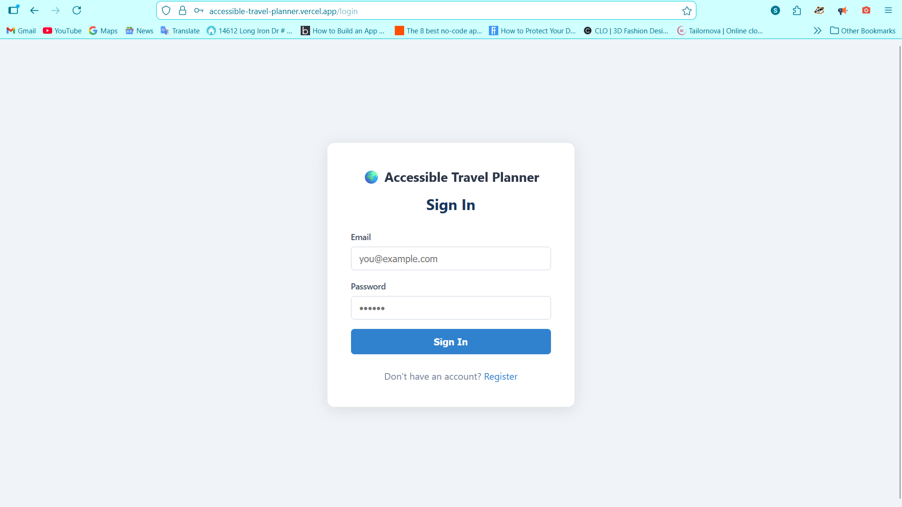
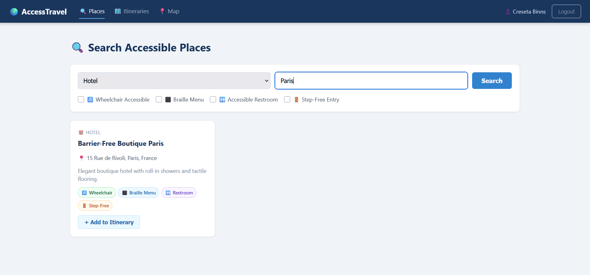
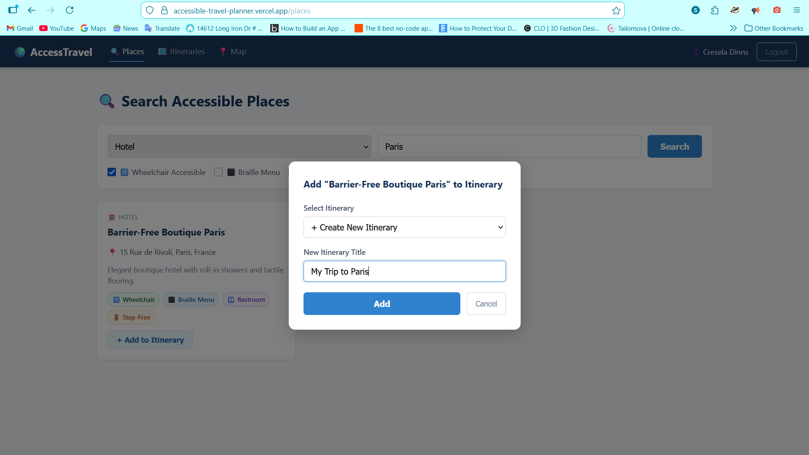
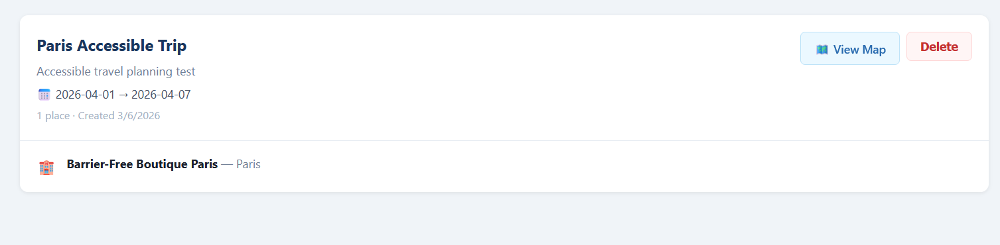
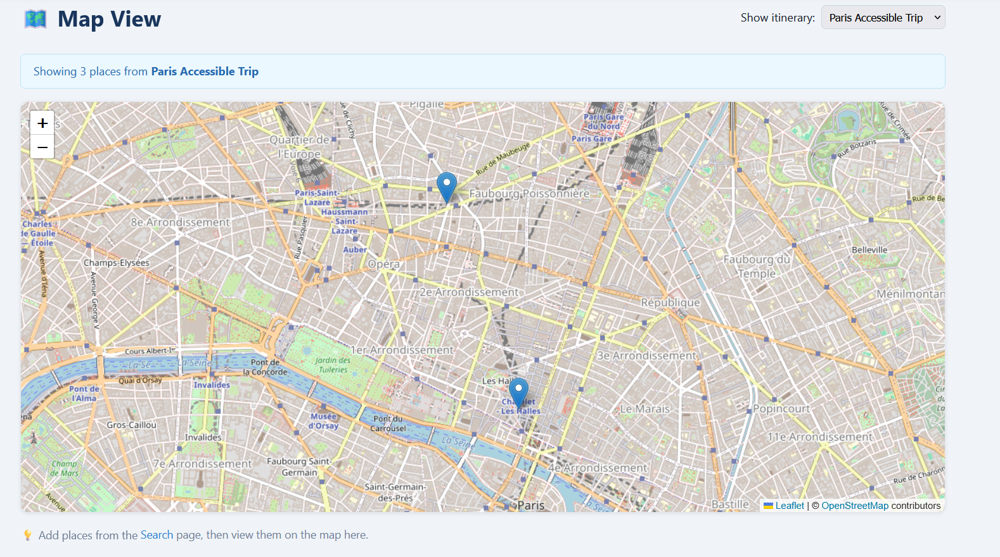

# Accessible Travel Planner

A full-stack web application for planning accessible travel. Find wheelchair-accessible hotels and restaurants, build itineraries, and view your saved places on an interactive map.

---

## Live Demo

Frontend  
https://accessible-travel-planner.vercel.app

Backend API  
https://accessible-travel-planner.onrender.com/api

Swagger API Docs  
https://accessible-travel-planner.onrender.com/api/swagger-ui/index.html

---

## Screenshots

### Login Page


### Search Accessible Places


### Create Itinerary Box


### Itinerary Builder


### Map View


---

## Tech Stack

| Layer       | Technology                                    |
|-------------|-----------------------------------------------|
| Backend     | Java 21, Spring Boot 3, Spring Security, JWT  |
| Frontend    | React 18, TypeScript, Vite, React Router      |
| Database    | PostgreSQL 16, Flyway migrations              |
| Map         | Leaflet + OpenStreetMap tiles                 |
| Docs        | Swagger / OpenAPI 3                           |
| Infrastructure | Docker Compose                             |

---

## Features

- **User Authentication** – Register and login with JWT-protected endpoints
- **Accessible Places Search** – Search hotels and restaurants with accessibility filters:
  - ♿ Wheelchair Accessible
  - ⬛ Braille Menu
  - 🚻 Accessible Restroom
  - 🚪 Step-Free Entry
- **Travel Itinerary** – Create itineraries, add places, view and delete them
- **Map View** – Interactive Leaflet map with OpenStreetMap tiles showing saved places

---

## Prerequisites

- [Docker](https://docs.docker.com/get-docker/) and [Docker Compose](https://docs.docker.com/compose/install/) (v2.x or later — use `docker compose`, not `docker-compose`)

---

## Running with Docker Compose

Docker Compose is the easiest way to run the entire stack (PostgreSQL, backend, and frontend) with a single command.

### Step 1 — Clone the repository

```bash
git clone https://github.com/Saharabenz94/accessible-travel-planner.git
cd accessible-travel-planner
```

### Step 2 — Build and start all services

```bash
docker compose up --build
```

This will:
1. Pull the `postgres:16-alpine` image and start the database.
2. Build the Spring Boot backend JAR and start it on port `8080`. Flyway runs automatically and applies all migrations, including the seed data (~30 accessible places).
3. Build the React frontend and serve it via nginx on port `3000`.

> The first build downloads Maven and npm dependencies, so it may take a few minutes. Subsequent starts are much faster.

### Step 3 — Open the application

Once you see log output like `Started AccessibleTravelPlannerApplication` from the backend container, all services are ready:

| Service        | URL                                             | Description                        |
|----------------|-------------------------------------------------|------------------------------------|
| **Frontend**   | http://localhost:3000                           | React web application              |
| **Backend API**| http://localhost:8080/api                       | REST API base path                 |
| **Swagger UI** | http://localhost:8080/api/swagger-ui.html       | Interactive API documentation      |
| **OpenAPI JSON** | http://localhost:8080/api/v3/api-docs         | Raw OpenAPI 3.0 spec               |

### Useful Docker Compose commands

```bash
# Run in detached (background) mode
docker compose up --build -d

# View logs for a specific service
docker compose logs -f backend
docker compose logs -f frontend

# Stop all services (keeps the database volume)
docker compose down

# Stop all services AND delete the database volume (resets all data)
docker compose down -v

# Rebuild a single service after code changes
docker compose up --build backend
```

---

## Exploring the API with Swagger UI

Swagger UI provides an interactive browser-based interface for all REST endpoints. No separate tool (e.g., curl, Postman) is required.

### Step 1 — Open Swagger UI

Navigate to **http://localhost:8080/api/swagger-ui.html** in your browser.

### Step 2 — Register a user

1. Expand the **Authentication** section → `POST /api/auth/register`.
2. Click **Try it out**, fill in the request body, then click **Execute**:

```json
{
  "name": "Jane Doe",
  "email": "jane@example.com",
  "password": "secret123"
}
```

3. The response body contains a `token` field — copy that value.

> If you already have an account, use `POST /api/auth/login` instead.

### Step 3 — Authorize all requests

1. Click the **Authorize 🔒** button at the top-right of the Swagger UI page.
2. In the **bearerAuth** field, paste your token (without the `Bearer ` prefix).
3. Click **Authorize**, then **Close**.

All subsequent requests from Swagger UI will now include the `Authorization: Bearer <token>` header automatically.

### Step 4 — Try the API

You can now call any protected endpoint directly from the browser:

- **Places → `GET /api/places/search`** — try filtering by `city=Paris` or checking `wheelchairAccessible=true`.
- **Itineraries → `POST /api/itineraries`** — create a new itinerary.
- **Itineraries → `POST /api/itineraries/{id}/items`** — add a place to an itinerary.

---

## Local Development (without Docker)

### Prerequisites

- Java 21+
- Maven 3.9+
- Node.js 20+
- PostgreSQL 16+

### Backend

```bash
# Create the database
psql -U postgres -c "CREATE DATABASE traveldb;"

# Run the backend (DB_HOST=localhost overrides the Docker default of 'postgres')
cd backend
DB_HOST=localhost mvn spring-boot:run
```

The backend starts on `http://localhost:8080`.

### Frontend

```bash
cd frontend
npm install
npm run dev
```

The frontend starts on `http://localhost:3000` and proxies `/api` calls to the backend.

---

## Database Schema

| Table               | Description                          |
|---------------------|--------------------------------------|
| `users`             | Registered users                     |
| `places`            | Hotels and restaurants               |
| `place_accessibility` | Accessibility features per place   |
| `itineraries`       | User travel itineraries              |
| `itinerary_items`   | Places added to an itinerary         |

Flyway migrations are in `backend/src/main/resources/db/migration/`. Seed data with ~30 accessible places is loaded automatically on first run.

---

## API Endpoints

All endpoints are under `/api`. Authentication endpoints are public; all others require a `Bearer` JWT token.

### Authentication

| Method | Path                | Description         |
|--------|---------------------|---------------------|
| POST   | `/api/auth/register` | Register a new user |
| POST   | `/api/auth/login`    | Login               |

### Places

| Method | Path                | Description                              |
|--------|---------------------|------------------------------------------|
| GET    | `/api/places/search` | Search places with accessibility filters |
| GET    | `/api/places/{id}`  | Get place by ID                          |

**Search query parameters:** `type`, `city`, `wheelchairAccessible`, `brailleMenu`, `accessibleRestroom`, `stepFreeEntry`

### Itineraries

| Method | Path                          | Description                     |
|--------|-------------------------------|---------------------------------|
| POST   | `/api/itineraries`            | Create a new itinerary          |
| GET    | `/api/itineraries`            | List itineraries for logged-in user |
| GET    | `/api/itineraries/{id}`       | Get a specific itinerary        |
| POST   | `/api/itineraries/{id}/items` | Add a place to an itinerary     |
| DELETE | `/api/itineraries/{id}`       | Delete an itinerary             |

---

## Environment Variables

| Variable      | Default                                    | Description                  |
|---------------|--------------------------------------------|------------------------------|
| `DB_HOST`     | `postgres`                                 | PostgreSQL host (`postgres` = Docker Compose service name; use `localhost` for local dev) |
| `DB_PORT`     | `5432`                                     | PostgreSQL port              |
| `DB_NAME`     | `traveldb`                                 | Database name                |
| `DB_USER`     | `postgres`                                 | Database user                |
| `DB_PASSWORD` | `postgres`                                 | Database password            |
| `JWT_SECRET`  | (hex string in config)                     | JWT signing secret           |

---

## Project Structure

```
accessible-travel-planner/
├── backend/                         # Spring Boot backend
│   ├── src/main/java/com/accessible/travel/
│   │   ├── config/                  # Security, OpenAPI config
│   │   ├── controller/              # REST controllers
│   │   ├── dto/                     # Data Transfer Objects
│   │   ├── entity/                  # JPA entities
│   │   ├── exception/               # Global exception handler
│   │   ├── repository/              # Spring Data repositories
│   │   ├── security/                # JWT filter, provider, UserDetailsService
│   │   └── service/                 # Business logic
│   └── src/main/resources/
│       ├── application.yml          # Configuration
│       └── db/migration/            # Flyway SQL migrations + seed data
├── frontend/                        # React + TypeScript frontend
│   └── src/
│       ├── api/                     # Axios API client
│       ├── components/              # Navbar, ProtectedRoute
│       ├── contexts/                # AuthContext
│       ├── pages/                   # LoginPage, RegisterPage, PlacesPage, ItineraryPage, MapPage
│       └── types/                   # TypeScript interfaces
├── docker-compose.yml
└── README.md
```

---

## Stopping Services

```bash
docker compose down          # stop and remove containers (keeps the database volume)
docker compose down -v       # also remove the database volume (resets all data)
```

